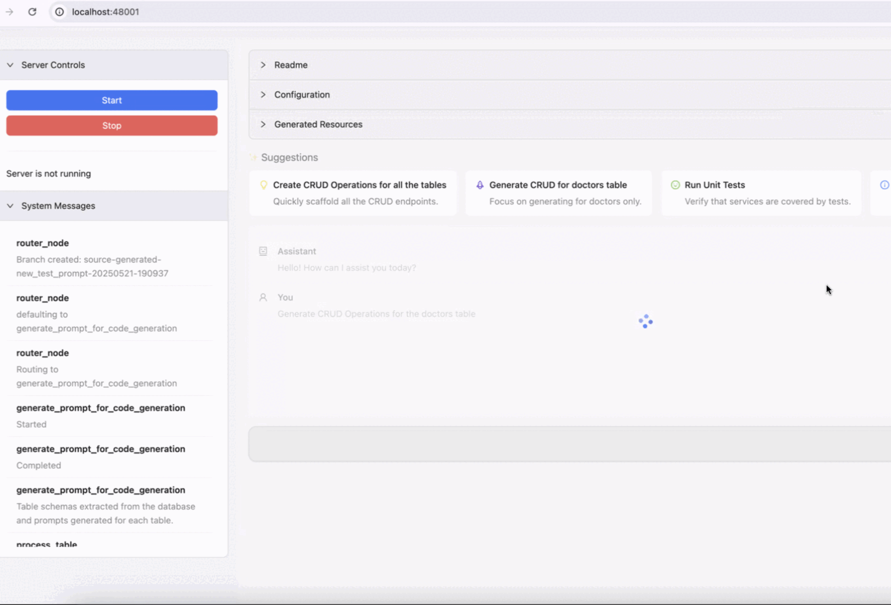

## 🚀 **AI-Powered Database CRUD & UI Generator**  
#### _Instantly generate full-stack admin panels, APIs, and UI from your database schema—powered by AI agents & LLMs_

**⚡ Automate 80% of your boilerplate code** – Say goodbye to manual CRUD coding! Let AI generate clean, production-ready database interfaces in seconds.  

- **✨ AI Agents** analyze your schema and generate optimized REST/GraphQL APIs  
- **🖥️ Auto-generated Admin UI** with filters, search, and CRUD operations  
- **🔌 Multi-DB Support** (SQL & NoSQL) with intelligent schema detection  
- **🎨 Customizable Templates** (React + MUI DataGrid)
- **🔒 Built-in Auth & Permissions** scaffolding  
- **📦 One-Codebase Export** for easy integration  

### 🚀 Perfect for:  
- Anyone wanting to quickly interact with their data for admin / internal purposes
- Devs tired of writing repetitive CRUD code  
- Teams managing complex data without dedicated frontend resources  
- AI engineers who want database UIs without full-stack work  

---


---
### Pre-requisites
- Python 3.11
- OPENAI API Key
- PostgreSQL database with tables

### Quick Start

#### 1. Install Dependencies

```sh
brew install uv
uv sync
```

#### 2. Start

```sh
python src/revolve/api.py
```


### Roadmap

- Authz and Authn configuration
- Support for other databases
- Support foreign key testing 
- Enhance UI to support lookups for foreign keys and editing json elegantly
- Support for enums while editing via the discovery apis
- Multi-turn conversations 
- Add fine-tuned Qwen 3 support in addition to paid model support.


### License

MIT
