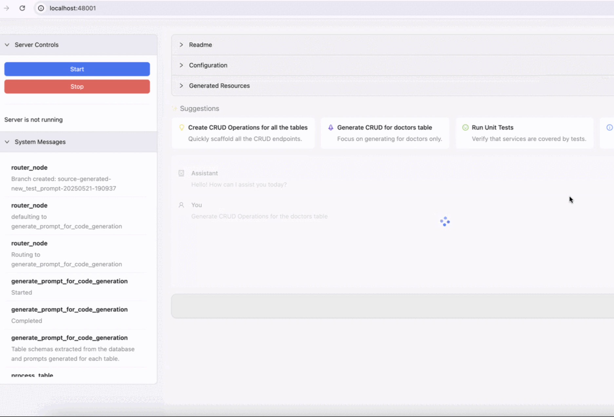

# Revolve

**Revolve** is an agentic Python code generation and editing tool that automates the creation of REST APIs, service logic, and test cases from natural language prompts. 
It uses the generated apps in a modern react UI to enable CRUD operations on tables. See our [Roadmap] for future features.

---


## Features

- **Prompt-driven API Generation:** Describe your requirements in natural language to generate Falcon-based REST APIs and service files.
- **Automated Test Generation:** Creates comprehensive pytest-based test suites for all generated endpoints and services.
- **Iterative Code Refinement:** Automatically revises code and tests based on test results until all tests pass or a stopping condition is met.
- **Database Integration:** Supports PostgreSQL with configurable connection via `.env`.
- **UI for Workflow Management:** React-based interface for configuring the database, sending prompts, viewing generated files, and monitoring test results.
- **Version Control Integration:** Optionally auto-commits and pushes changes to a Git repository.
- **Test Reporting:** Tracks test history and generates Markdown and JSON reports for all test runs.

---

## Quick Start

### 1. Install Dependencies

```sh
brew install uv
uv sync
```

### 2. Configure Environment

Create a `.env` file in the project root with the following variables:
```env
OPENAI_API_KEY=your-openai-key
DB_NAME=your_db_name
DB_USER=your_db_user
DB_PASSWORD=your_db_password
DB_HOST=localhost
DB_PORT=5433
SOURCE_FOLDER=absolute/path/to/src/revolve/source_generated
# Optional for Git integration:
GIT_REPO_URL=https://github.com/your/repo
GIT_USER_NAME=your-git-username
GIT_USER_EMAIL=your-email@example.com
GIT_PUSH_CHANGES=true
```

---

### 3. Unified Start (Recommended)

Start both the backend and frontend together using:

```sh
python src/revolve/api.py
```

This will launch both the API server and the UI automatically.

---

### 4. (Optional) Run Backend and Frontend Separately

If you prefer to run the backend and frontend independently:

#### a. Run the Backend (Optional)

```sh
python src/revolve/main.py
```

#### b. Run the Frontend (Optional)

```sh
cd src/revolve/ui
npm install
npm run dev
```

The UI will be available at [http://localhost:5173](http://localhost:5173) by default.

---

## Usage

1. **Configure Database:** Enter your PostgreSQL connection details in the UI or [`.env`](.env ).
2. **Enter a Prompt:** Describe the API or service you want to generate (e.g., "Generate CRUD operations for the doctors table").
3. **Review Generated Files:** Inspect and edit generated Python files and tests in the UI.
4. **Run & Review Tests:** The system runs tests automatically and iteratively refines code until all tests pass.
5. **Download or Push Code:** Download generated code or push to your configured Git repository.

---

## Project Structure

- [`src/revolve/source_generated`](src/revolve/source_generated ) — Generated API, service, and test files.
- [`src/revolve/ui`](src/revolve/ui ) — React frontend (see [`App.jsx`](src/revolve/ui/App.jsx )).
- [`src/revolve`](src/revolve ) — Core backend logic, code generation, and workflow orchestration.
- [`states`](states ) — Workflow state snapshots for debugging and traceability.
- [`db-seeds`](db-seeds ) — Example database seed files.

---

## Testing

- Tests are generated and run automatically for each resource.
- Test results and history are saved in:
  - [`src/revolve/source_generated/test_status_history.json`](src/revolve/source_generated/test_status_history.json )
  - [`src/revolve/source_generated/test_status_report.md`](src/revolve/source_generated/test_status_report.md )

---

## Environment Variables

- `OPENAI_API_KEY` — Required for code generation.
- [`DB_NAME`](src/revolve/ui/App.jsx ), [`DB_USER`](src/revolve/ui/App.jsx ), [`DB_PASSWORD`](src/revolve/ui/App.jsx ), [`DB_HOST`](src/revolve/ui/App.jsx ), [`DB_PORT`](src/revolve/ui/App.jsx ) — PostgreSQL connection.
- `SOURCE_FOLDER` — Where generated code is saved.
- `GIT_*` variables — For optional Git integration.

---

## Development Notes

- The backend uses Falcon for REST APIs and psycopg2 for PostgreSQL.
- The frontend uses React, Ant Design, and Vite.
- All generated code and tests are placed in the path specified in  `SOURCE_FOLDER`.
- Static files can be served if `STATIC_DIR` is set in [`.env`](.env ).

## Building the package for distribution
To build the package for distribution, run:

```sh
uv pip install hatch
hatch build
```
This will create a `dist` directory with the built package.
You can then install the package using:

```sh
pip install dist/revolve-0.1.0-py3-none-any.whl
```
and then run the app using:

```sh
revolve-api

---

## License

MIT